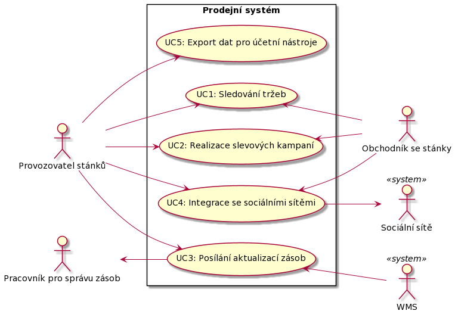

# Dokumentace architektury č. 1
## System overview
Popisovaná architektura se vztahuje na aplikaci pro místní obchodníky se stánky pro prodej párků v rohlíku, tedy se jedná o prodejní systém pro takové uživatele.

Zvolená architektura č. 1 je SOA.

### Functionality
Funkcionalita prodejního systému je popsána níže pomocí případů níže:

- **UC1**: Systém by měl umožnit obchodníkovi se stánky sledovat tržby podle času a místa. Dále by provozovatel stánku by měl vidět tržby za jeho stánek.
- **UC2**: Přes prodejní systém by mělo jít realizovat slevové kampaně, respektive lze v určitém časovém rozmezí zlevnit specifické produkty. Jelikož k této funkcionalitě má přístup provozovatel stánků, tak i obchodník se stánky, tak systém musí mězi nimi zprostředkovat dohodu o spuštění slevové kampaně.
- **UC3**: Systém by měl umožnit posílat aktualizace zásob mobilním pracovníkům pro správu zásob (jen ti, kteří jezdí na místo se zásobami).
- **UC4**: V systému by měla být funkcionalita, která umožní integraci se sociálními sítěmi, takže zákazníci mohou být informováni o tom, že je stánek s hot dogy poblíž.
- **UC5**: Ze systému by mělo jít exportovat informace ve formátu importovatelném účetními nástroji.

#### **Kód diagramu**
Kód diagramu je pro tvorbu diagramu přes PlantUML.

> @startuml
> 
> left to right direction
>
> actor "Provozovatel stánků" as provozovatel
>
> actor "Obchodník se stánky" as obchodnik
>
> actor "Pracovník pro správu zásob" as zasobnik
>
> actor WMS `<<system>>`
>
> actor "Sociální sítě" as socialniSite `<<system>>`
>
> rectangle "Prodejní systém" {
>
>    usecase "UC1: Sledování tržeb" as UC1
>
>    usecase "UC2: Realizace slevových kampaní" as UC2
>
>    usecase "UC3: Posílání aktualizací zásob" as UC3
>
>    usecase "UC4: Integrace se sociálními sítěmi" as UC4
>
>    usecase "UC5: Export dat pro účetní nástroje" as UC5
>
>}
>
> provozovatel --> UC1
>
> provozovatel --> UC2
>
> provozovatel --> UC3
>
> provozovatel --> UC4
>
> provozovatel --> UC5
>
> obchodnik -up-> UC1
>
> obchodnik -up-> UC2
>
> obchodnik -up-> UC4
>
> UC3 <-- WMS
>
> zasobnik <-- UC3
>
> UC4 --> socialniSite
>
> @enduml

### Quality Attribute Requirements
Quality attribute scénáře jsou uvedeny níže, přičemž jsou od sebe odděleny atributem kvality.
#### Výkon
- Prodejní systém musí být jednoduchý a běžet na malých zařízeních
    - QAS1: Notebook je příliš těžký na to, aby se dal efektivně používat při prodeji hot dogů na ulici.