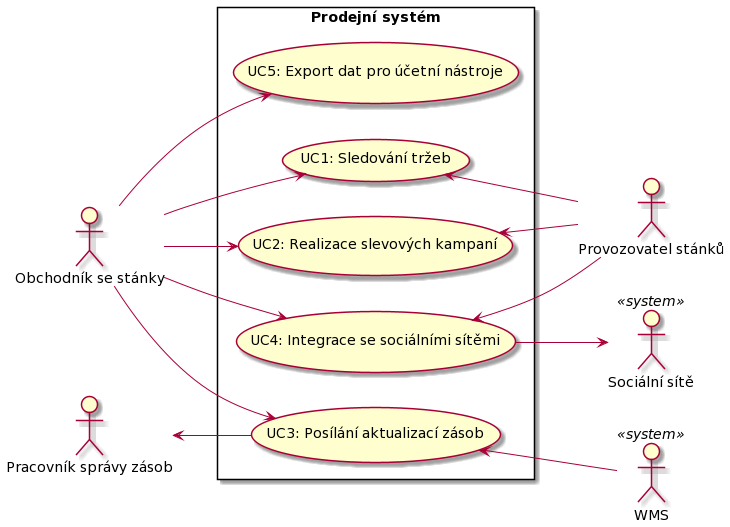
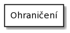

# Dokumentace architektury č. 1
## Struktura dokumentace
- [Přehled systému](#system-overview "Přehled systému")
- [Architektonická rozhodnutí](./rozhodnutí "Architektonická rozhodnutí")
- [Diagram komponent](./komponenty "Diagram komponent")
- [High level přehled modulů](./moduly "High level přehled modulů")
- [Diagram nasazení](./umístění "Diagram nasazení")
- [Hodnocení architektury](./hodnoceni "Hodnocení architektury")

## System overview
Popisovaná architektura se vztahuje na aplikaci pro místní obchodníky se stánky pro prodej párků v rohlíku, tedy se jedná o prodejní systém pro takové uživatele.

Zvolená architektura č. 1 je SOA.

---

### Functionality
Funkcionalita prodejního systému je popsána níže pomocí případů níže:

- **UC1**: Systém by měl umožnit obchodníkovi se stánky sledovat tržby podle času a místa. Dále by provozovatel stánku by měl vidět tržby za jeho stánek.
- **UC2**: Přes prodejní systém by mělo jít realizovat slevové kampaně, respektive lze v určitém časovém rozmezí zlevnit specifické produkty. Jelikož k této funkcionalitě má přístup provozovatel stánků, tak i obchodník se stánky, tak systém musí mězi nimi zprostředkovat dohodu o spuštění slevové kampaně.
- **UC3**: Systém by měl umožnit posílat aktualizace zásob mobilním pracovníkům pro správu zásob (jen ti, kteří jezdí na místo se zásobami).
- **UC4**: V systému by měla být funkcionalita, která umožní integraci se sociálními sítěmi, takže zákazníci mohou být informováni o tom, že je stánek s hot dogy poblíž.
- **UC5**: Ze systému by mělo jít exportovat informace ve formátu importovatelném účetními nástroji.

#### **Vysvětlivka diagramu**
- **Use case** (případ užití) - Jde o funkci systému.

- **Actor** (Aktor) - Jde o člověka nebo systém, který komunikuje se systémem.

- **Ohraničení systému** - Jde o grafické vymezení modelovaného systému.

#### **Kód diagramu**
Kód diagramu je pro tvorbu diagramu přes PlantUML.

Odkaz na textový soubor s kódem: [odkaz](./assets/diagram_codes/deployment_diagram.puml).

---

### Quality Attribute Requirements
Quality attribute scénáře jsou uvedeny níže, přičemž jsou od sebe odděleny atributem kvality.
#### Výkon
- Prodejní systém musí být jednoduchý a běžet na malých zařízeních
    - QAS1: Notebook je příliš těžký na to, aby se dal efektivně používat při prodeji hot dogů na ulici.

#### Elasticita
- Prodejní systém musí zvládnout zátěž s vysokou variabilitou.
    - QAS2: Zaznamenávání provedených transakcí (prodej párků) bude hlavně probíhat ve specifický čas během dne (tzn. nebudeme očkávat, že hlavní zátěž systému bude probíhat ráno nebo večer).
