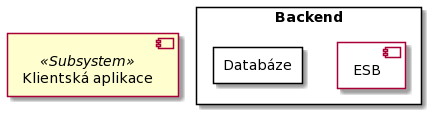

# Component view
## Primary presentation
### UML

### Kód diagramu
Kód diagramu je pro tvorbu diagramů přes PlantUML.

> @startuml
>
> left to right direction
>
> component "Klientská aplikace" as client `<<Subsystem>>`
>
> package Backend {
>
>   component ESB `<<Subsystem>>`
>
>   component "Slevová služba" as SaleCampainService `<<Subsystem>>`
>
>   component "Služba pro tržby" as SalesService `<<Subsystem>>`
>
>   component "Služba pro zásoby" as StocksService `<<Subsystem>>`
>
>   component "Exportovací služba" as ExportService `<<Subsystem>>`
>
>   component "Služba pro integraci se sociálními sítěmi" as SocialMediaService `<<Subsystem>>`
>
>   package Databáze {
>
>   component "Databázový systém" as DbS `<<Subsystem>>`
> 
>   }
>
>   ODBC - DbS
>
>   SaleCampainServiceAPI - SaleCampainService
>
>   SalesAPI - SalesService
>
>   StocksAPI - StocksService
>
>   ExportAPI - ExportService
>
>   SocialMediaAPI - SocialMediaService
>
>   ESB --> SaleCampainServiceAPI
>
>   ESB --> SalesAPI
>
>   ESB --> StocksAPI
>
>   ESB --> ExportAPI
>
>   ESB --> SocialMediaAPI
>
>   SaleCampainService --> ODBC
>
>   SalesService --> ODBC
>
>   StocksService -down-> ODBC
>
>   ExportService --> ODBC
>
> }
>
> ESBAPI - ESB
>
> SocialMediaService -right-> ExternalSocialMediaAPI
>
> SalesService -left-> WarehouseMgmtSystemAPI
>
> client -up-> ESBAPI
>
> @enduml

## Element catalog
- **Klientská aplikace**
    - Jedná se o aplikaci, která běží na klientském zařízení, tedy v kontextu tohoto řešení jde o aplikaci pro provozovatele stánků a obchodníka se stánky.
- **ESB**
    - Jde o Enterprise Service Bus, která slouží pro sjednocení služeb v rámci backendu prodejního systému.
    - ESBAPI:
        - Tato část reprezentuje aplikační programové rozhraní komponenty ESB, se kterou komunikuje klientská aplikace.
- **Slevová služba**
    - Jedná se o službu pro práci se slevovými akcemi, tedy pro jejich správu, což zahrnuje jejich vytváření aktualizování a smazání.
    - SalesCampainServiceAPI:
        - Jde o rozhraní této služby, které je využíváno ESB, resp. klientskou aplikací skrze ESB pro komunkaci se slevovou službou.
- **Služba pro tržby**
    - Jde o službu, která realizuje funkcionalitu pro sledování tržeb podle času a místa.
    - SalesAPI:
        - Jde o rozhraní této služby, které je využíváno ESB, resp. klientskou aplikací skrze ESB pro komunkaci se slevovou službou.
- **Služba pro zásoby**
    - Jde o službu, která realizuje funkcionalitu pro posílání aktualizací zásob mobilním pracovníkům pro správu zásob.
    - StocksAPI:
        - Jde o rozhraní této služby, které je využíváno ESB, resp. klientskou aplikací skrze ESB pro komunkaci se službou pro zásoby.
    - WarehouseMgmtSystemAPI:
        - Jde o API externího warehouse management systému, které slouží pro sbírání aktuálních dat o stavu zásob, přičemž na základě této informace služba pro zásoby vytváří aktualizace v databázi, které si klientské zařízení stahují.
- **Exportovací služba**
    - Tato služba má na požadavek vybrat vhodná data z databáze, následně je převést do vhodného formátu pro účetní nástroje a poslat je nazpět.
    - Export API:
        - Jde o rozhraní této služby, které je využíváno ESB, resp. klientskou aplikací skrze ESB pro komunkaci s exportovací službou.
- **Služba pro integraci se sociálními sítěmi**
    - Jedná se o službu pro integraci s používanými sociálními sítěmi, tedy klientské aplikace nemusí využívat SDK daných sítí, ale stačí, aby využívali tuto službu. Ve výsledku se tedy jedná o abstrakci konkrétních API sociálních sítí, což třeba lze využít v případě, že jedna informace (= post na sociální síti) lze upravit do formátu pro více než jednu sociální síť (= informace o polozce stánku s hotdogy bude nahrána např. na instagram a twitter zároveň).
    - SocialMediaAPI:
    - ExternalSocialMediaAPI:
- **Databázový systém**
    - Jedná se o databázový systém, který tedy obsahuje databáze prodejního systémů a systém řízení báze dat (SŘBD).
    - ODBC:
        - Známé rozhraní pro komunikaci se SŘBD za cílem abstrakce od konkrétních databázových systémů.

## Context diagram
N/A

## Variability guide
**Konfigurovatelnost přístupu k datům**

Pro konfiguraci přístupu k datům, tak aby byla snadná podpora libovolného dodavatele databáze, tak je třeba psát SQL dotazy, tak aby neobsahovaly syntax specifický pro nějakého dodavatele databáze.

## Rationale
Rozdělení komponent, tak aby odpovídali SOA souvisí s [třetím ADR](../rozhodnutí/3_rozhodnuti_o_architekture_backendu.md "Třetí architektonické rozhodnutí"), kde bylo rozhodnuto pro využití SOA a také konkrétně REST, kdy v požadavcích zadavatele nebyly stanoveny požadavky na backend, jen že řešení nebude třeba za 3 roky vyměnit a RESTové služby jsou pro splnění daného požadavku vhodné díky jejich návaznosti na HTTP protokol.

## Related Views
- [Deployment view](../umístění/deployment.md "Deployment view")