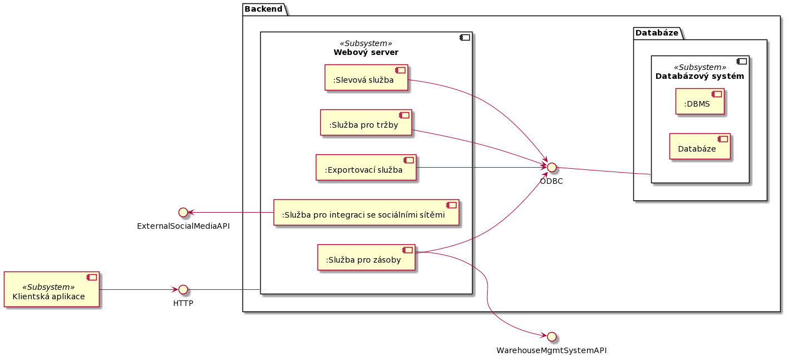

# Component view
## Primary presentation
### UML

### Kód diagramu
> @startuml
>
> component "Klientská aplikace" as client `<<Subsystem>>`
>
> rectangle Backend {
>
> component ESB
>
> rectangle Databáze {
>   
> }
>
> }
>
> @enduml

## Element catalog

## Context diagram

## Variability guide

## Rationale

## Related Views
