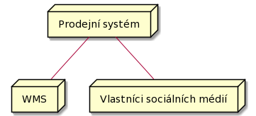

# Deployment view
## Primary presentation
### UML

#### **Kód diagramu**
> @startuml
>
> node "Klientské zařízení" as clientDevice `<<device>>` {
>
> artifact "Klientská aplikace prodejního systému" `<<application>>`
>
> }
>
> node "Reverse proxy" as reverseProxy `<<device>>`
>
> node "Aplikační server" as appServer `<<device>>` {
>
> artifact "ESB" `<<application>>`
>
> }
>
> node "Web server" as webServer `<<device>>` {
>
> node Kestrel `<<execution environment>>` {
>
> artifact "API aplikace" `<<application>>`
>
> }
>
> }
>
> node "Databázový server" as dbServer `<<device>>` {
>
> node "MS SQL Server" `<<DBMS>>`
>
> }
>
> node "WMS server" as wmsServer `<<device>>`
>
> node "Social media server" as socialMediaServer `<<device>>`
>
> clientDevice -- reverseProxy : "HTTP"
>
> reverseProxy -- appServer : "HTTP"
>
> appServer -- webServer : "HTTP"
>
> webServer -- dbServer : "ODBC"
>
> webServer -left- wmsServer : "HTTP"
>
> webServer -- socialMediaServer : "HTTP"
>
> @enduml

## Element catalog
- **Klientské zařízení**
    - Fyzické zařízení v roli tenkého klienta, přičemž toto zařízení může mít libovolný operační systém.
- **Klientská aplikace prodejního systému**
    - Jde o klientskou aplikaci našeho prodejního systému, přičemž tato aplikace běží na tenkém klientovi.
- **Reverse proxy**
    - Jde o fyzický server, který stojí mezi klientským zařízením a ESB. Tento server realizuje funkci reverse proxy.
- **Aplikační server**
    - Jde o aplikační server, na kterém běží aplikace ESB.
- **ESB**
    - Aplikace realizující funkcionalitu Enterprise Service Bus.
- **Web server**
    - Fyzický server, na kterém běží Kestrel a .NET aplikaci pro webové API.
- **Kestrel**
    - Multiplatformní webový server pro .NET aplikace.
- **API aplikace**
    - Jde o `ASP.NET Core` API aplikaci, která poskytuje endpointy a operace (aplikační model se konkrétně jmenuje `ASP.NET Core Web API`) pro požadované služby (ty jsou stanovené v diagramu komponent).
- **Databázový server**
    - Jedná se o fyzický server, na kterém běží databáze a MS SQL Server, přičemž jako komunikační protokol je využíván ODBC.
- **MS SQL Server**
    - Jde o Database Management System od společnosti Microsoft, který umožňuje pracovat s relačními databázovými tabulkami, které jsou používané naším prodejním systémem.
- **WMS server**
    - Jedná se o externí servery, které dohromady realizují Warehouse Management System, respektive jde o server poskytující jednotné rozhraní k daným serverům nebo serveru.
- **Social media server**
    - Jde o externí servery vlastníka sociálních sítí, respektive jde o server s API pro práci se sociální sítí vlastníka

## Context diagram

### **Kód diagramu**
> @startuml
>
> node "Prodejní systém" as prodejniSystem
>
> node WMS
>
> node "Vlastníci sociálních médií" as socialMediaOwners
>
> prodejniSystem -- WMS
>
> prodejniSystem -- socialMediaOwners
>
> @enduml

## Variability guide
**Vysoké množství podporoavných klientských zařízení**

Klientská aplikace prodejního systému by měla být multiplatformní, aby uživatelé nemuseli vlastnit specifické zařízení pro užívání prodejního systému.

**Nezávislost na platformě webového serveru**

Pro běh aplikace pro webové API je použit Kestrel, tedy aplikace nemusí běžet jen na Windows serveru (IIS), ale je podporovanán i Linux (nginx, Apache).

## Rationale

## Related Views
- [Diagram komponent](../moduly/components.md "Diagram komponent")