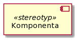
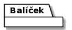

# Component view
## Primary presentation
### UML

### Vysvětlivka pro diagram
- **Komponenta** - Jde o komponentu modelovaného systému.

- **Rozhraní** - Jde o rozhraní poskytované nebo konzumované komponentou.

- **Balíček** - Jde o seskupení jiných prvků diagramu do jednoho logického celku.

#### **Kód diagramu**
Kód diagramu je pro tvorbu diagramu přes PlantUML.

Odkaz na textový soubor s kódem: [odkaz](../assets/diagram_codes/component_diagram.puml).

---

## Element catalog
- **Klientská aplikace**
    - Jedná se o aplikaci, která běží na klientském zařízení, tedy v kontextu tohoto řešení jde o aplikaci pro provozovatele stánků a obchodníka se stánky.
- **Webový server**
    - Jde o komponentu či komponenty (neuvažujeme load balancing), která slouží pro hostování webové aplikace pro webové API a služby.
- **Slevová služba**
    - Jedná se o službu pro práci se slevovými akcemi, tedy pro jejich správu, což zahrnuje jejich vytváření aktualizování a smazání.
- **Služba pro tržby**
    - Jde o službu, která realizuje funkcionalitu pro sledování tržeb podle času a místa.
- **Služba pro zásoby**
    - Jde o službu, která realizuje funkcionalitu pro posílání aktualizací zásob mobilním pracovníkům pro správu zásob. Důvodem existence této služby, je skutečnost, že tato služba může mít "real-time" spojení (např. skrze SignalR) s Warehouse Management systémem, a tedy je schopno poskytovat klientské aplikaci aktuální data na požádání (= klientská aplikace tedy nemusí dané real-time spojení realizovat => úspora výpočteních prostředků klientského zařízení). Samozřejmě tato služba také může využívat databázi pro ukládání stavu zásob, pokud není vyloženě potřeba, aby konkrétní uživatel věděl měl přehled o aktuálním stavu zásob.
    - WarehouseMgmtSystemAPI:
        - Jde o API externího warehouse management systému, které slouží pro sbírání aktuálních dat o stavu zásob, přičemž na základě této informace služba pro zásoby vytváří aktualizace v databázi, které si klientské zařízení stahují.
- **Exportovací služba**
    - Tato služba má na požadavek vybrat vhodná data z databáze, následně je převést do vhodného formátu pro účetní nástroje a poslat je nazpět.
- **Služba pro integraci se sociálními sítěmi**
    - Jedná se o službu pro integraci s používanými sociálními sítěmi, tedy klientské aplikace nemusí využívat SDK daných sítí, ale stačí, aby využívali tuto službu. Ve výsledku se tedy jedná o abstrakci konkrétních API sociálních sítí, což třeba lze využít v případě, že jedna informace (= post na sociální síti) lze upravit do formátu pro více než jednu sociální síť (= informace o polozce stánku s hotdogy bude nahrána např. na instagram a twitter zároveň).
    - ExternalSocialMediaAPI:
        - Jde o různé externí API sociálních sítí, které jsou využívané touto službou, tak aby klientská aplikace nemusela přímo pracovat s danými API.
- **Databázový systém**
    - Jedná se o databázový systém, který tedy obsahuje databáze prodejního systémů a systém řízení báze dat (SŘBD).
    - ODBC:
        - Známé rozhraní pro komunikaci se SŘBD za cílem abstrakce od konkrétních databázových systémů.

---

## Context diagram
N/A

---

## Variability guide
**Konfigurovatelnost přístupu k datům**

Pro konfiguraci přístupu k datům, tak aby byla snadná podpora libovolného dodavatele databáze, tak je třeba psát SQL dotazy, tak aby neobsahovaly syntax specifický pro nějakého dodavatele databáze.

---

## Rationale
Rozdělení komponent, tak aby odpovídali EDA souvisí s [čtvrtým ADR](../rozhodnutí/4-architektura-backendu "Čtvrté architektonické rozhodnutí"), kde bylo rozhodnuto pro využití EDA a také konkrétně Websocket, kdy v požadavcích zadavatele nebyly stanoveny požadavky na backend, jen že řešení nebude třeba za 3 roky vyměnit a webové služby jsou pro splnění daného požadavku vhodné.

---

## Related Views
- [Deployment view](../umístění "Deployment view")
- [High Level Module View](../moduly "High Level Module View")
