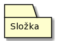

# High Level Module View
## Primary presentation

### Vysvětlivka diagramu
- **Package** (balíček) - Označuje modul (resp. komponentu) vystupující v modelovaném systému.

- **Folder** (složka) - Jde o šložku v rámci modulu.

### Kód diagramu
Kód diagramu je pro tvorbu diagramu přes PlantUML.

Odkaz na textový soubor s kódem: [odkaz](../assets/diagram_codes/modules_diagram.txt).

---

## Element catalog
- **Aplikace webové API**
    - Jedná se o aplikaci, která realizuje webové API a služby, přičemž tato aplikace běží na webovém serveru.
- **Klientská aplikace**
    - Jde o aplikaci prodejního systému, která běží na klientském zařízení.
- **Sdílená knihovna**
    - Jde o knihovnu, která je sdílená webovou aplikací a klientskou aplikací za účelem sdílení doménového modelu mezi nimi.
- **Views**
    - Jedná se o složku s tzv. Views, což jsou soubory definující uživatelské rozhraní (strukura, styly, animace, vazby na ViewModels a jiné).
- **ViewModels**
    - Jde o složku s tzv. ViewModels, což jsou soubory obsahující vlastnosti a příkazy, které může View využívat. Výhodou tohoto oddělení o UI je lepší testovatelnost.
- **Models**
    - Jde o složku s tzv. Models, což jsou třídy zapouzdřující data aplikace, tedy lze je považovat za doménový model aplikace, což obvykle zahrnuje business a validační logiku.
- **Services**
    - Jedná se o složku s tzv. Services, což jsou služby pro abstrakci metod ve ViewModels, tedy například místo toho, aby každý ViewModel implementoval zobrazení dialogových oken, tak to lze přesunout do Service třídy a využít ji skrze Dependency Injection.
- **Controllers**
    - Jedná se o složku se soubory obsahující metody, které jsou namapovány na konkrétní endpointy služeb nebo mohou být namapovány automaticky.
- **DataAccess**
    - Jde o složku na serverové aplikaci se soubory obsahující operace s databázovými tabulkami, které jsou definované v databázovém kontextu, který je ve stejné složce.
- **Migrations**
    - Jde o složku se soubory databázových migrací a databázového snapshotu, které jsou využívané EF Core.

---

## Variability guide
None

---

## Other information
Pro klientskou aplikace je zvolen architektonický vzor MVVM (znázorněn níže), což odpovídá složkám v elementu *Klientská aplikace*, přičemž modely jsou sdílené s webovou API skrze sdílenou knihovnu, což je dynamicky linkovaná knihovna v rámci softwarového řešení, jelikož jsou obě aplikace a knihovna řešena v rámci .NET, tak není třeba řešit interoperabilita.

Výhodou MVVM vzoru je vysoká znalost mezi .NET vývojáři.

---

## Related views
- [Diagram komponent](../moduly/ "Diagram komponent prodejního systému")