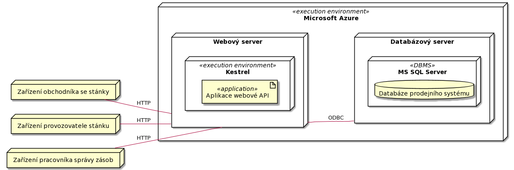
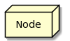
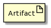
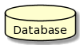

[< Zpět](../ "Zpět na přehled systému")

# Deployment view
V tomto pohledu je zobrazena infrastruktura prodejního systému.

## Primary presentation
### UML

### Vysvětlivka diagramu
- **Node** (uzel) - Jde o fyzické zařízení nebo prostředí pro zpracování softwaru (tzn. execution environment).

- **Artifact** (artefakt) - Artefakt označuje fyzický výskyt softwaru.

- **Database** (databáze) - Jde o znak databáze, která je součástí SŘBD.

#### **Kód diagramu**
Kód diagramu je pro tvorbu diagramu přes PlantUML.

Odkaz na textový soubor s kódem: [odkaz](../assets/diagram_codes/deployment_diagram.puml).

---

## Element catalog
- **Zařízení obchodníka se stánky**
    - Fyzické zařízení v roli tenkého klienta, přičemž toto zařízení může mít specifický operační systém (Windows, Android, iOS).
- **Zařízení provozovatele stánku**
    - Fyzické zařízení v roli tenkého klienta, přičemž toto zařízení může mít specifický operační systém (Windows, Android, iOS).
- **Zařízení pracovníka správy zásob**
    - Fyzické zařízení v roli tenkého klienta, přičemž toto zařízení může mít specifický operační systém (Windows, Android, iOS).
- **Microsoft Azure**
    - Jde o cloudové prostředí Azure od firmy Microsoft.
- **Web server**
    - Fyzický server, na kterém běží Kestrel a .NET aplikaci pro webové API. Samozřejmě zde neuvažujeme load balancing, tedy v realitě může existovat několik síťových prvků (reverse proxy, load balancer) před webovým servrem, a také může existovat více fyzických webových serverů.
- **Kestrel**
    - Multiplatformní webový server pro .NET aplikace.
- **Aplikace webové API**
    - Jde o `ASP.NET Core` API aplikaci, která poskytuje endpointy a operace (aplikační model se konkrétně jmenuje `ASP.NET Core Web API`) pro požadované služby (ty jsou stanovené v diagramu komponent).
- **Databázový server**
    - Jedná se o fyzický server, na kterém běží databáze a MS SQL Server, přičemž jako komunikační protokol je využíván ODBC.
- **MS SQL Server**
    - Jde o Database Management System od společnosti Microsoft, který umožňuje pracovat s relačními databázovými tabulkami, které jsou používané naším prodejním systémem.

---

## Context diagram
N/A

---

## Variability guide
**Vysoké množství podporovaných klientských zařízení**

Klientská aplikace prodejního systému by měla být multiplatformní, aby uživatelé nemuseli vlastnit specifické zařízení pro užívání prodejního systému.

**Nezávislost na platformě webového serveru**

Pro běh aplikace pro webové API je použit Kestrel, tedy aplikace nemusí běžet jen na Windows serveru (IIS), ale je podporovanán i Linux (nginx, Apache).

---

## Rationale
Výhodou využití REST služeb je abstrakce od konkrétní implementace služeb, tedy klientská aplikace je nezávislá na daných službách a komunikuje s nimi za pomoci webového serveru a HTTP protokolu. Další výhodou je využívání serveru Kestrel, který umožňuje nasadit webovou API na nginx nebo Apache, tedy není zde potřeba využívat IIS.

Pro snazší provoz prodejního systému je zvolené prostředí MS Azure, protože serverová a klientská aplikace je napsaná na platformě .NET, dále vývojářský tým má nejvíce zkušeností s danou cloud platformou.

---

## Related Views
- [Diagram komponent](../komponenty "Diagram komponent")
